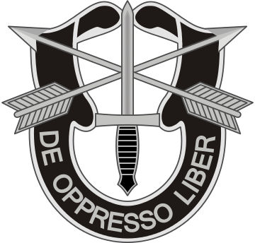
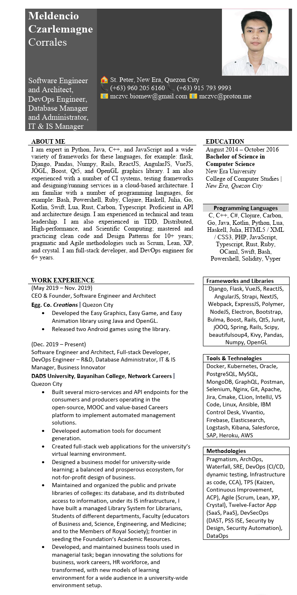

## Special Forces, Est. 1851

## Unity, Freedom, Victory

## Canadian Truckers, DAD System and University, Bayanihan College, Network Careers, `EGG Co.`

### Company Websites
> `Canada.us` `Dads.net` `Bayanihan.Learning` `Network.Careers` `Egg.co`

### `mczvc`: `[Meldencio Czarlemagne Corrales]` [`Egg Co.`]
- [Bayanihan Learning](#bayanihan-learning-and-college) — One Language, One Learning, *at a time*.

## Partners in Business
### `Ryan` and `Gem Noces`
* `Vergie’s Restaurant`
* `DAD’s Gym`
* ...

### `Johnella Kyle San Juan`
* `mczvc` `jksj`

## Licensing, Patent, Permission
[Licensee](./LICENSE)

# Trademarks Registered

# we are all members of the [](https://iglesianicristo.net)[](https://incgiving.org)
[](https://www.pasugo.com.ph)

## Changing lives through `God`’s Words.
### We are encouraging you:
to a nearest or inside `His House` and `Church` for a `Worship Services`, because this is the **Truth**, **The Kingdom** we seek, and the **Greatest Membership** you will ever receive. Through *it* We will be saved, come the day of `Judgement`.
- **(Genesis 12:[1-2])**

```
Now the LORD said to Abram, 

“Go forth from your country, 

And from your relatives 

And from your father’s house,

To the land which I will show you; 

And I will make you a great nation, 

And I will bless you, 

And make your name great;

And so you shall be a blessing;
```

- **(Genesis 28:[16-17])**

``` 
Then Jacob awoke from his sleep and said, 
“Surely the LORD is in this place, and I did not know it.” 
And he was afraid and said, 
“How awesome is this place! 
This is none other than the house of God,
and this is the gate of heaven.”
``` 

- **(2 Cor. 4:[1-4], NASB): Paul’s Apostolic Ministry, [:5-6]**:

``` 
For we do not preach ourselves but Christ Jesus as Lord, 
and ourselves as your bond-servants for Jesus’ sake. 
For God, who said, 
“Light shall shine out of darkness,” 
is the One who has shone in our hearts to give the light of
the knowledge of the glory of God in the face of Christ. 
```

- **(Philippians 1:[8-11]: Thanksgiving, NASB)**

``` 
For God is my witness, how I long for you all
with the affection of Christ Jesus.
And this I pray, that your love may abound still more
and more in real knowledge and all discernment,
so that you may approve the things that are excellent,
in order to be sincere and blameless until the day of Christ;
having been filled with the fruit of righteousness
which comes through Jesus Christ,
to the glory and praise of God.
```

# Central Temple

[](https://www.instagram.com/p/ClxocDFBepY/)
## ✡️ (1 King 6:12) 

```
“Concerning this house which you are building,
if you will walk in My statutes and execute My ordinances
and keep all My commandments by walking in them,
then I will carry out My word with you which I spoke
to David your father.
```

# We are all members of
## `The Lifesaving Society`, `St. John`;
## `Emergency Medical Services`, `Calgary Lifeguards`, `Calgary Sun`;
## `Commonwealth Royal Life Saving Society` and the `International Life Saving Federation`;
## `Canada’s National Lifeguards`.

- `The Society` is a national, volunteer organization and registered charity.
- `The Society`’s national office is in `Ottawa`. 

### Program Education 
- Program education refers to the formal training in swimming, lifesaving, lifeguarding and leadership provided by the Society. `The Society` reviews and revises its programs on a regular basis. 
- The programs of the **Society** are offered through the **Society**’s affiliate members. Affiliate members include the pools and waterfronts of municipal recreation departments, local **YMCA** — **YWCA**s, youth camps, private programs, and the athletic facilities of schools, colleges, and universities. Over `1,000,000` **Canadians** are trained and certified every year in the **Society**’s programs.

### Public Education 
- Public education refers to the **Society**’s efforts to ensure that all **Canadians** are **"Water Smart."**  

### Partnerships 
`The Society` works in co-operation and consultation with national, provincial, regional, and community agencies, governments, and organizations in the areas of prevention, education, safe safety. 

### Consultation 
`The Society` provides advice to education, recreation, health, and government agencies that oversee aquatic recreation in `Canada`. In addition, **Society** representatives act as expert witnesses at coroner’s inquests and in court cases.

# Subsidiaries under Egg Co.
## **Egg Co.**, `Meldencio Czarlemagne`
### `CEO` and `Founder`
- ### [CV] > ([:docx](./mczvc/CV%20(1-10-2024_1245).docx)) | ([:pdf](./mczvc/CV_PDF_1-10-23_1300.pdf))
- ### [Resume]


### HQs: 4-CAs
- 2 in the `Philippines`,
- 1 in `Central America`, and
- 1 in `Canada`

## `Vanguard™` `Consortium` — `Phi` `Chi` `Alpha` — `Epsilon` `Sigma`, **Pico-Veras-Corrales**
_Vanguard_ leads a `Bayanihan Learning`, a partner and **Forever Dear** for every **Eranian**s.

- **Vanguard** is a _western_ term for **Angel** (Fem. `Angelou`, Masc. `Angelo`).
- A full-arm or a mastery of professionalism, a ready professionals, probably an `Allied Health Professional`, aimed and tenured with secured practices, to educate, and/or mobilize, and eventually liberate the people of education, to be prepared to serve the **Almighty God**, an endeavored professionals, united in serving **Him** faithfully and wholeheartedly.

## `Vanguard` — `Sigma` `Epsilon`, `Sigma` `Alpha`
- Is a **Software Engineers** and **Software Architects** that is also a `CBI` or `Christian Brotherhood International`


**(Exodus 8:[1-2], NASB)**

```
Then the LORD said to Moses, 
“Go to Pharaoh and say to him, 
‘Thus says the LORD, 
“Let My people go, that they may serve Me. 

“But if you refuse to let them go, behold, 
I will smite your whole territory with frogs.
```

### _Royal Filipinos_ are **Reservist Frogmen**

### Royal Knighthood of `Vanguard`

**(Genesis 27:40, NASB)**

```
“And by your sword you shall live, 

And your brother you shall serve; 

But it shall come about when you become restless, 

That you shall break his yoke from your neck.”
```

**[New English Translation]**

```
You will live by your sword 
but you will serve your brother. 
When you grow restless, you will 
tear off his yoke from your neck.”
```

- **Pico**: Engineering and Architectural Firm
- **Veras, LLC**: Law Firm under **Bar** #`117571`, U.S. District Court, Southern District of [Florida]
- **MC `PAF & RAF`** Security Services & Consultancy
- **Corrales**: a **Blue Ocean** Institute, headquartered in 3-CAs
- **mczvc** is an Institute, offering `Software Architecture`, `Engineering and Technology`, specializing for **Fitness Equipments and Medical Devices**, and Revolutionized the **Cybersecurity**; in partnership with `Accenture`, `MIT`, `Department of Homeland Security`, and `Allied Health`, *respectively*) 
  - and a **School for Business and Management**, specialized from `Harvard Business School`

Branch name: DAD System and University, [**DADSU**]

# DAD University
<details>
<summary>Blueprint education model, for instructors, educators, and ...</summary>

- Instead of Exam, a pre-review notes or study pointer guide checklist is introduced up-front to students.
    * Exam is for evaluation, re-evalution and assessment. So we seperate it in Two, another program.
- The Companion Workbook or Module Guide or Textbooks is the only Miscellaneous Purchase should be required during the whole course of first-semester study; 
- second-semester is a combined laboratory (such as in Computing Course) and course-work

## Courses Offered
### Undergraduate
1. BSc. Computer Science major in Software Architecture
  - First Year is all about Fundamentals, and History of Computing (the Programming Laguages, and the Computers that have been built), and an in-depth analysis to Process Methods, Computer Organization, Writing Essays for the Thesis.
  - Second Year, 
     1. First Sem is Introduction to Software Engineering.
     2. Second Sem is a laboratory, course-work in applying both fundamentals to computing and practicing the principle of SE, and the student will be first introduced to doing a mini-thesis.
 - Third Year is a combined Research Program, and building their Work Network through the OJT Program with partnered Companies in the Industry, this is special for our Institutionalized Association of Computing Machinery, called Vanguard Industries.
     1. Second Semester is a basic study of Web Developing fundamentals.
 - Fourth Year, 
     1. First Semester is about the Fundamentals to Software Architecture.
     2. Second Semester is about their Thesis.

### Continuous Learning Program
It is an extended studies with the Introduction to Business Management, 

- The Undergraduate Student is offered with a 30-day trial membership for a free access to the vast and wide resources from the Consultancy Program of the University's Vanguard Consultancy.
    1. Members may wish to ask what resources they should need in what they wish to pursue and earn title of expertise.
    2. They may now start their Official Membership, as:
    3. They will receive their resources, upon payment for the purchase of materials, resources, free of consultations fee.
    4. Members may wish to start early their program before the 30-day trial period.
- On **Members**' first extension, the practicing student will learn the application of Managerial methods to Software Architecture Profession as a Business Developer, and he will gain a practitioner's title to Professional Software Architect, equiped with the Managerial Methods.
- On its succeeding extensions of the Program, the Members are free to choose their **upskilling** of *technologies*, *computer language*, *expertise*, *..*; this is a continuous studies and improvement of learning their knowledge to the vast web studies of the Computer Science.

`CLP` is the prime and continuous membership to the Masteral Degree Application, to freely choose their designated expertise, practice, or specialization. As they reach the qualification, Members shall earn their Degree as MSc. in Computer Science, with their chosen expertise as their specialization, certified as they earn their title.

### Doctorate Degree Under CLP
Members, with a MSc. Degree, should pursue their Doctorate. They are, at this time, a United Alumnus Royals as Professionals.
</details>

# Undergraduate Catalog 2024

<details>
<summary>Computer Science (BS)</summary>

> I'm interested!

## Sample Curriculum for the Bachelor of Science in Computer Science

### Year 1 (Fall Semester)

<details><summary>(3) CS 111 Computer Science Principles (BICS)</summary>

    Concepts of Computer Science

    Broad view of computer science: hardware; operating systems; software design and development; algorithms; networks; and applications.
</details>

<details><summary>(3) CS 140 Introduction to Computing I</summary>
  
    Introduction to Computing I 
    
    Programming course that assumes basic computer literacy. Introduces a high-level programming language and basic problem solving.
</details>
 
<details><summary>(3) ENG 101 English Composition I</summary>

    English Composition I
    
    Instruction and practice in analyzing and composing the academic expository essay.
</details>
 
<details><summary>(5) MATH 150 Calculus I (FQR)</summary>

    Calculus I 
    
    Fundamental concepts of calculus: limits, continuity, and derivatives. Mean Value Theorem of Calculus, integration techniques, and applications.
</details>

<details><summary>(3) ACS 103 Interpersonal Communication Skills (Choose elective of either: [A]llied Health, or [B]usiness Finance)</summary>

    Interpersonal Communication Skills
    
    Principles and practices of oral communication emphasizing message formation and delivery; listening; perception; awareness of verbal and nonverbal codes; and managing conflict.
</details>

> 17 – Total Credits

#### Textbooks:

1. Computer Science Principles: The Foundational Concepts of Computer Science
2. Introduction to Computation in Physical Sciences: Interactive Computing and Visualization with Python
     - This book provides a practical and comprehensive introduction to computational problem solving from the viewpoints of practitioners in both academic and industrial worlds.
3. A Student's Introduction to English Grammar
    - This groundbreaking undergraduate textbook on modern Standard English grammar is the first to be based on the revolutionary advances of the authors' previous work, The Cambridge Grammar of the English Language (2002). The text is intended for students in colleges or universities who have little or no previous background in grammar, and presupposes no linguistics. It contains exercises, and will provide a basis for introductions to grammar and courses on the structure of English, not only in linguistics departments but also in English language and literature departments and schools of education.
4. Calculus [12e. ed.]
5. (a) Interpersonal Relationships Professional Communication Skills for Canadian Nurses, or (b) People-Centric Skills: Interpersonal and Communication Skills for Financial Professionals

### Year 1 (Spring Semester)

<details><summary>(3) CS 150 Introduction to Computing II</summary>

    Introduction to Computing II 
    
    Algorithmic problem solving with a modern programming language. Language syntax; basic design methods; algorithms; and abstraction.
</details>
 
<details><summary>(3) ENG 102 English Composition II</summary>
    
    English Composition II
    
    Builds upon the analytical and writing skills developed in 101 with emphasis on argumentation and critical synthesis of information based on research.
</details>
 
<details><summary>(3) RA 101 Reasoning & Argumentation (Choose elective between [a] and [b])</summary>

    Reasoning and Argumentation
    
    Students will learn to analyze, critically evaluate, and construct arguments. Topics include organizing information, detecting fallacies, analyzing meaning, and using effective methods of argumentation.
 </details>

<details><summary>(5) MATH 152 Calculus II (BPS)</summary>
    
    Calculus II 
    
    Applications of integration; techniques of integration; improper integrals; polar coordinates; infinite sequences and series; and Taylor's theorem.
</details>

<details><summary>(3) MATH 224 or MATH 223 Discrete Mathematics (BPS)</summary>

    Discrete Mathematics 
    
    Mathematical concepts and techniques essential to computer science: logic; sets; algorithms; methods of proof; induction and recursion; simple counting techniques; and graph theory. Does not count toward a major in mathematics.
    
    Logic & Mathematical Reasoning
    
    Concepts and techniques essential to advanced mathematics; logic, methods of proof, sets, relations, induction, functions, cardinality, combinatorics, and graph theory.
</details>

> 17 – Total Credits

#### Textbooks/Workbooks:

1. Introduction to Bioinformatics and Clinical Scientific Computing
2. AP English Literature and Composition Premium, 2024: 8 Practice Tests + Comprehensive Review + Online Practice
     - Barron’s AP English Literature and Composition, Premium, 2024, includes in-depth content review and online practice. It’s the only book you’ll need to be prepared for exam day.
3. [a] Experimental Philosophy of Language: Perspectives, Methods, and Prospects, or <br>[b] Islamic Disputation Theory: The Uses & Rules of Argument in Medieval Islam
   - This book charts the evolution of Islamic dialectical theory (jadal) over a four-hundred year period. It includes an extensive study of the development of methods of disputation in Islamic theology (kalām) and jurisprudence (uṣūl al-fiqh) from the tenth through the fourteenth centuries. The author uses the theoretical writings of Islamic theologians, jurists, and philosophers to describe the concept. Overall, this investigation looks at the extent to which the development of Islamic modes of disputation is rooted in Aristotle and the classical tradition.
   - (plus) The Practice of Argumentation: Effective Reasoning in Communication (Critical Reasoning and Argumentation)
4. Calculus and Linear Algebra: Fundamentals and Applications
    - This textbook offers a comprehensive coverage of the fundamentals of calculus, linear algebra and analytic geometry. Intended for bachelor’s students in science, engineering, architecture, economics, the presentation is self-contained, and supported by numerous graphs, to facilitate visualization and also to stimulate readers’ intuition. The proofs of the theorems are rigorous, yet presented in straightforward and comprehensive way. With a good balance between algebra, geometry and analysis, this book guides readers to apply the theory to solve differential equations. Many problems and solved exercises are included.
5. Discrete Math I, II, III
    - Discrete Mathematics with Applications [5 ed.], Cengage Learning
    - Discrete Mathematics with Coding
    - Connecting Discrete Mathematics and Computer Science

### Year 2 (Fall Semester)

<details><summary> (3) CS 234 Database and Web System Development</summary>

    Database and Web System Development

    An introduction to multi-tier software systems and database programming and their application to web-based information storage and retrieval systems.
 </details>

- (3-4) MATH elective

> 6-7 – Total Credits

#### Textbooks:
1. Enterprise System Architectures: Building Client Server and Web Based Systems
    - In `CLP`, you will get a wide range of topics and certain recommendations, when you enter in our `Consultation Program`, for example, we had received this **new** technological *tool* called `Strapi`, if you are fond to JS ecosystem: 
        - Designing Web APIs with Strapi: Get started with the Strapi headless CMS by building a complete learning management system API
2. Jаvascript Programming: 3 In 1 Security Design, Expressions And Web Development
3. In `CLP`, there are so many *new* and **relevant** technologies (programming languages, frameworks, libraries with well-documented ecosystem, programming tools, and practices), here are the examples of *new* and **robust** `full-stack` of Web Development:
    - Rust Web Development, Manning Publications
    - PHP 8 Basics. For Programming and Web Development
    - Learn React with TypeScript: A beginner's guide to reactive web development with React 18 and TypeScript, [2 ed.]
4. Architectural Framework for Web Development and Micro Distributed Applications
5. Applied Mathematics for Database Professionals +
    - Database Design Using Entity-Relationship Diagrams [3 ed.]
    - Database Systems. A Pragmatic Approach [3 ed.]
    - `CLP`, Azure Database Services: Easy and Understandable Guide for Beginners
    - `CLP`, Mastering PostgreSQL 15: Advanced techniques to build and manage scalable, reliable, and fault-tolerant database applications
    - `CLP`, AWS Certified Database. Study Guide. Specialty (DBS- C01) Exam
    - `Advanced CLP`, Database Systems for Advanced Applications: 28th International Conference, DASFAA 2023


### Year 2 (Spring Semester)

<details><summary>(3) CS 286 Intro to Computer Organization & Architecture</summary>
 
    Introduction to Computer Organization and Architecture
    
    Processor, memory, I/O structure of computer systems, data representations, instruction set architecture of typical processor as hardware/software interface, processor implementation, performance evaluation methods.
 </details>

- (3) MATH Elective

<details><summary>(3-4) STAT 244 or STAT 380 Research Methods, Statistics, and Applications (IBM)</summary>

    Statistics 
    
    Summarizing data, including distributions, change and growth, relationships. Basics of survey design and experimental design. Inferential statistics, including confidence intervals and hypothesis testing. 

    Statistics For Applications
    
    Descriptive statistics; basic probability rules and distributions; inferences for means; variances and proportions; design and analysis of experiments; and regression analysis.
</details>

> 9-10 – Total Credits

#### Textbooks:

1. Computer Organization And Architecture. Designing For Performance [11 Global Edition]
2. Computer Organization [18 ed.]
3. Modern Computer Architecture and Organization: Learn x86, ARM, and RISC-V architectures and the design of smartphones, PCs, and cloud servers [2 ed.]
4. `CLP`:
    - Computer Organization and Design MIPS Edition: The Hardware/Software Interface [6 ed.]
    - Computer Architecture and Organization: Fundamentals and Architecture Security
    - Student Study Guide With IBM® SPSS® Workbook for Research Methods, Statistics, and Applications [3 ed.]
5. Research Methods, Statistics, and Applications [Paperback ed.]

### Year 3 (Fall Semester)

<details><summary>(3) CS 360 Ethical and Secure Computing</summary>

    Ethical and Social Implications of Computing
    
    An introduction to the social, ethical, legal, and professional contexts in which software systems are developed and utilized.
</details>
<details><summary>(3) CS 340 Algorithms and Data Structures</summary>

    Algorithms and Data Structures
    
    Considers appropriate choice of data structures, comparisons of algorithms, recursive algorithms, complexity, and introduction to parallel algorithms.
 </details>
<details><summary>(3) CS 314 Operating Systems</summary>

    Operating Systems
    
    Processes, threads, and synchronization; I/O and memory management at the hardware and OS levels; file systems; and implementation of basic OS abstractions, concurrent programming. 
</details>

> 9 – Total Credits

### Year 3 (Spring Semester)

<details><summary>(3) CS 325 Software Engineering</summary>
    
    Software Engineering
    
    Introduction to the concepts and techniques required to develop complex software systems and manage software projects. Emphasis on object-oriented methodologies and modeling via UML.
</details>

<details><summary>(3) CS 447 Networks and Data Communications</summary>
    
    Networks and Data Communications
    
    Concepts of networks and data communications. Networking protocols and architecture; data encoding and transmission; network management; and distributed applications.
</details>

<details><summary>(3) CS 330 Programming Languages</summary>
    
    Programming Languages
    
    Design, appropriateness and linguistics issues associated with different programming languages and programming paradigms. Covers syntax and semantics of languages, including BNF Notation.
</details>

- (3) Breadth Life Science (BLS)

> 12 – Total Credits

#### Textbooks:

1. Software Engineering for Data Scientists
    - This practical book bridges the gap between data science and software engineering, clearly explaining how to apply the best practices from software engineering to data science.

2. Computer networks. Data communications, Internet and security.
    - The authors explore various aspects of information processing for the design of service systems, efficient management, secure storage, and transmission.

3. Computer science to the Point: Computer Science for Life Sciences Students and Other Non-Computer Scientists
     - This textbook is aimed at students of non-specialist courses with computer science components. Special emphasis is placed on the so-called life sciences, such as medical technology, rescue engineering, biotechnology, environmental engineering or process engineering.

4. MATLAB for Engineering and the Life Sciences [2 ed.]
    - This book is a self-guided tour of MATLAB for engineers and life scientists. It introduces the most commonly used programming techniques through biologically inspired examples. Although the text is written for undergraduates, graduate students and academics, as well as those in industry, will find value in learning MATLAB. <br><br>The book takes the emphasis off of learning syntax so that the reader can focus more on algorithmic thinking. Although it is not assumed that the reader has taken differential equations or a linear algebra class, there are short introductions to many of these concepts. Following a short history of computing, the MATLAB environment is introduced. Next, vectors and matrices are discussed, followed by matrix-vector operations. The core programming elements of MATLAB are introduced in three successive chapters on scripts, loops, and conditional logic. The last three chapters outline how to manage the input and output of data, create professional quality graphics and find and use MATLAB toolboxes. Throughout, biomedical and life science examples are used to illustrate MATLAB's capabilities.

### Year 4 (Fall Semester)

* (3) CS 425 Senior Project: Software Design
     - Senior Project: Software Design <br>First part of a two-semester sequence in which teams complete the design and planning stages of a software development project. Selected topics in software development, group dynamics, and project management. Not for Graduate credit.
 
* (3) CS Elective I
* (3) CS Elective II
* (3) CS Elective III
* (3) Breadth Social Science (BSS)

> 15 – Total Credits

### Year 4 (Spring Semester)

* (3) CS 499-Senior Project: Software Implementation
    - Senior Project: Software Implementation <br>Second part of a two-semester sequence in which teams implement, test, and deploy software development project that was planned and designed in CS 425. Includes a formal presentation to the computer science faculty.

* (3) CS Elective IV
* (3) CS Elective V
* (1) Health Experience (EH)
* (4) Rizal IV, VI
* (3) U.S. Race, Gender, and Equity (ERGU) or Global Cultures, Race, and Equity Education (EREG)*

> 17 - Total Credits

#### Textbooks:
- José Rizal: Life, Works, and Writings of a Genius, Writer, Scientist, and National Hero [Second Edition]

> If a course satisfies both the EREG and ERGU requirements, students will be given credit for one of the attributes and need to take a course that fulfills the other attribute.

>Total Hours 120

</details>


# Bayanihan Foundation ℠
## _(Bayan Ni Juan)_ 
`Bayanihan Foundation` is a collaboration of the following foundations: MC, JK, RG, GB, Roberto Sr., CJ, CA; PC-SJ-NC-VB-DD-DC-GP-GC Groups, and **mczvc** Institute, all under in One Name.

# INC Giving
[](https://incgiving.org/)

# Bayanihan Learning and College
-  forever tuition! No hidden charge(s). Transparent and flat rate for all `Filipino`(s). A two-semester college education.
- ☪️ Shari’ah-Compliant
- Decentralized Learning
- All alums (alumnus and alumnae) will be called , all are Dear to Everyone!
- A much higher body of commission on education will be needed in the future to guarantee and protect academic freedom for continuing intellectual growth, advancement of learning and research, development for responsible and effective leadership, education of high level professionals, and enrichment of historical and cultural heritages. This is not to disrupt every (body or) commission that regulates the higher education, but to honor and preserve the dignity of every professional educators, through different and separate model of recompensation, a system that is guaranteed to liberate everyone in a balanced and stable ecosystem of education financing through the continuous effort and evaluation of every members of the committee. Learning will never be fun! nor continuous; Nor prosperous! Are you dreaming of all of these three, abudantly? `Remember`: *Everything* is **possible** with the **Almighty**! And all of Good things comes from **God**! Abudantly. **Always** and **Forever**.
- We value these 6-major-character competencies to everyone: effort, value, skills, knowledge, wisdom, and abilities.

### **[Proverbs 4:5-9, NET]**

```
Acquire wisdom, acquire understanding; 
do not forget and do not turn aside from the words I speak.

Do not forsake wisdom, and she will protect you; 
love her, and she will guard you.

Wisdom is supreme – so acquire wisdom, 
and whatever you acquire, acquire understanding! 

Esteem her highly and she will exalt you; 
she will honor you if you embrace her. 

She will place a fair garland on your head; 
she will bestow a beautiful crown on you.”
```

Branch name: Network Careers — A value-based work, network and platform for careers [**nc**]
# Network.Careers 

A **nice, network platform** of careers for value-based work, or job postings that will revolutionize the traditional jobs, which rates work by time-based rate (usually by an hourly rate) of a worker or employee that still occupies _their_ time, and obligates them to work only on an old way of time-based kind of modelled work, 
which rates them poorly to do one job or project, one task at a time, locking them to a poor-waged situations of tedious and mundane life; those kind of model of work is not only outdated, but also blocking them to the **new kind of model of work**, thus earning *debt* and *frustrations* to the **inner peace** of truly liberating work; 
thus, with, by, (or with) the motto: 
[**A**]lways [**S**]uceeding ™, instead, we are proving you your **true values** you had before, **be ready to engage**, as we will **showcase you to the whole world**—of  fun, memorable, and exciting kind of interaction (notice that we are already emphasizing you to the **successful** and **always working system** of *work*, because it shouldn't be called *work* by now—**then and now**);
thus, becoming and valuing: yes! your **happiness** *you truly seek*, and your **succeeding values**—we are about to empower,
**so stop hiding** *it*! It's now time to **value your true rate**, and to pursue too, your career—and it's not late to **showcase your skills**, **value**, 
and use **your value-based rate of work**, because we believed that you should be payed according to your **value** for every (credentials, skills, and *everything that contributes* to your **value**) that you earn, 
you will see how professional's in their careers rate their work; and,
it's *never* *later than ever*—that you will learn how and why **value-based rate** is truly liberating!
—you will *ever* be **truly free**; `be free, now and then`!

— to Us you are **truly empowered** with this kind of reworked system; 
we are **empowering** the people's _freelancing kind of mindset_ when it comes to working, because they always wanting, 
and wanted, to value the power to interact and to meet their true needs, and wants, with their profound purpose—new and hardly knew;

Changing the world—not the truth, the **truth about Us**: of our `values`, of our `capabilities`, and of our `essence` **to the world**!

To every one of Us, we are all **truly essential** to the **Almighty One**.

And so, we had also found our **true purpose**, to *serve and protect* the `values` **of every one of us**!

Techs, (or *technological*[**s**]): as they may say it; we are improving our kind, way of life, not just the system of industrialization!
We are about to revolutionize the word `revolutionary`, and all the aspect of workings, your specialized needs, and your social life, ahead!
Before it was revolutionized!

Socials, (or *Socialites*): however they may say it! we are also have a social standing to the Society, on the wave of *Technological Facts* and its **Mediums**, a popular culture: by **empowerment**; 
or by *humiliation*, because of mediocrity or *whatever* the reason(s): a *branded humans* or *mortified soul* as it is, because of these Social Contracts and stagnant Social Standings: 
still humiliating Us as it is to not have *these kinds* a social life!
https://www.psychologytoday.com/us/blog/hide-and-seek/201408/the-psychology-humiliation

We are now here to empower you! — You mattered, anyways.

With our Institute and partners, you do now have the power of the **True Royal Degree** to communicate and network with the `Royal Professionals` — to work professionally or endlessly, thus earning also endlessly with (someone you can trust), or by a `Smart Move`™, done and earn with your kind of Profession(s), by doing One Work or One Project, at a time, 
thus saving effort and *probably* time, preserving and upskilling your **value** — your **skills**, 
with the redefined work contract(s): 
you are now, but—now equipped with your acquired values + your *honed* **God-Given Gift** from the **Almighty One**!

Thus, you are *not also* **working Smart**, but engaging **Smartly**℠ also with our revolutionized, **Smart Contract for the People**™, naturally, it's **By Design**™.  

It's time to **learn, apply, and lead** *courageously* and *victoriously*, or **work collaboratively**, with Us — because We had predefined our **Every Smart Environment**℠, 
and with You — with an **honor of excellency** on every aspect of your career!

We had also revolutionized the **Management Aspect** of *Every Known Career*(s), not just for managing, but it's for the **growth and development** of _**every** team_ and its **members**.
You can now work **freely**, with your predefined **dignity** and **honor**, to showcase your **new values**, **comfortably** and *with easiness*!
Now, that's an **integrity**.

You have *now* expanded your horizon, horizontally and vertically, with **your natural talents**, or by practicing and exercising it, for every **best opportunities** we had **prepared for you**;
you: to **Do It**, and We: **to provide** it, because with us—you are **simply the best**.

Leading your new way to the paved industries since the last `Industrial Revolution` aka *“The Intelligence Revolution”*.
`Forget everything that hinders you`:
because we had an **Awesome God**, which was the **Almighty One**, **Who** guides us to every deal of technologies, done by *subversive* *men*! 

**We are all created equal**, but *revolutionaries*! 🇵🇭🕍🕎🇮🇹

It's not only easy to do things you love and wants,
but also—it was becoming true and possible!
Never waver your dreams, not anymore—`never ever give up on your dreams`!
> Do it *now* with passion, providing your needs:
for **your family and friends**!
> *Don't* forget that:
> ✡️ We are **simply the best**.

## All for the glory of `Almighty God`.

**[1 Timothy 1:17, New Living Translation]**

```
All honor and glory to God forever and ever!

He is the eternal King, 

the unseen one who never dies; 

he alone is God. Amen.
```

### We are `Almighty God’s People`, focused on `People Helping People`
Aside from revolutionizing the `HR` workforce, picked the best Economical Systems for a certain economical problem—as a **solution**, 
we had made models for: `business' (consumers, producers)`, financing, managing 
(the people — inside/internal and outside/external, the employment agencies, and the intermediaries — and the project), 
built the new but effective processes, of old but still gold, which are all maximized to its full usefulness for improve 
and/or to increase productivity—by `System of Performance`℠, a dual gold efficiency, 
(compare with the old style of _double-time efficiency_; I am here to emphasize the **value** + **effectiveness** of a work in a project); 
and by crafting every single needed tools — for every aspect of business — by the **Excellent Engineers** and 
**Prime Architects** — providing the solutions to every modelling problem of its users, 
systematically and with ease-of-use. Done with `Agility by Design ℠` by the **Royal Developers** and **Agile HR**, 
to manage the project, prime to its **People**, or the **happy customers** and its **producers**, equally!
We are a `Royal Club of every Professionals`, to do the work, because we value the **People**, 
but we value more our **Family**, and mostly, our **One True God**, above all, in serving one right.

# `Royal Club`™ Machines, Equipments, and Technology
**We are** the *Next* Silicon Valley! A Century and a Score Four! Because we love Tacos and Waffles!

- For business, an MBA devices (not just machines) as *technological* tool would be suffice!
- For Medical Devices, we are now _Uprising with the Tron_ ℠ — [we do not delay] — 
- revolutionizing the **security and safety**, and the *New* **Tele-health**, of **Medical equipments and devices**.
- A Century and Score, we are now in the field of Digital Electronics, Medical frontier of *non-invasive procedures*, and mobility — fitness and wellness of everyone!
- We Are Bayanihan!

# Bayanihan Software
Bayanihan Software is subsidiary and trademark of parent company, **Egg Co.**, to develop, maintain, 
and is only reserved, for now, for the following:

1. Medical Technology software, and
2. Business Software of Tools or Platforms

- ## Bayanihan Open-Source Software, Patented Open-Source(d) Software, Patented Medical Devices and/or Equipments, Dual Patent and Licensing, Business or Medical Technologies

- All are under **Vanguard Licensing** ℠
- *Patented Open-Source Software* is a hybrid of patenting and limited liable distribution license using `Eclipse license` format, for you to entwine in the same, or minimally different, patent. Be sure that you understand the condition(s) when your equipment will be operated by the technicians, for training them, or for maintaining them. OSS is a good practice for that, if you are to minimize the cost of training, hiring trainers, engineers, maintainers, technicians, or apprentice with your biomedical equipment. **Vanguard Biomedical Equipments** is just for that.
- Licensing and Copyright preservation uses **Standard Software Licensing** for granting permission, under your preferred license provider, in public or private manner, to distribute the source and/or software(s).
- Patenting is encouraged to do *under* [Goldstein Patent Law], which states:

```
Your patent is an investment that drives the long-term value of your business.
```

- [Dual Patenting] is observed under differing jurisdiction
- [Business Method can be patented]

## Bayanihan OS, and Picosoft℠
`Bayanihan OS` is an **Optimal Solution**, **Operating System**, running on a bare Linux Kernel, with its bare Metal OS, will be done as a **derivative work** of existing and available technologies, its architecture and look is planned ahead, to renew the look and feel of latest *Apple* `iPhone` and its *Ecosystem* and innovate the Manufacturing Process, to produce a desired, especialized devices.

- **Picosoft℠** and its Ecosystem is a *premium* but excellent machines and devices and Software Systems, and a SmartPhone under the brand `PS℠`, architected and perfected with the **Grace of Almighty God**.
- The natural tendency to perfect these technology is all by the **Excellent Unification of Almighty God**, to **Trust His Guidance**, and **Do His Will**. There's no more secret to Perfection, but *with* **Almighty God**: we can all do all things through **His Son's Name**, with **His Holy's Spirit**, **His Guidance**, and *with* **His Knowledge**. `God` is **True** and **Pure**! We are now building the *Ultimate Community*, **He** to Help and Guide for the Education, Training, and **Mastering His Perfect Will**. He to Choose, Call, and with His Grace, Who'd Organized, and **Blesses** Us with `Everything` that comes from **Him**. 
- *Sounds* **Utopian Socialist**, *right*? ;)
- All profits will proceed to the [FYM Foundation]; and
- The ROI of ₱1 will be **forever sufficient** to support our cause, <br> All for the Praise and Glory to the Almighty, and to our Lord's name, Jesus Christ.

### We are Here to leave this earth a little better than before, 
but why *not* **be the best**? By all of our collaboration we can do, we can be, if **we are simply the best**, with all the *gifts* and **guides** — to **nurture**, the *Only One Goldilocks* — our *One Planet*. *One* **Earth's Star**. **One People at a Time**. *Under One Moon*.

**God is Great! Good and Gracious all the time!**

If there would be a *last message* that i can leave **here**, it’s all the **gratefulness in Life** that **God** bestow on *all of Us*.

```
5th. (G) would be the God's Gift.
6th., and last, was His Easter Egg.
7th. would be the first and last slice of life. That is:
8th: is to share abudantly!
9th. is the last Star, the last step to execute all the adequate prerequisites.
 ... I am born perfectionistic, but without The Father, i would be nothing. 
This is sufficient declaration to have a perfect plan; because His salvation is True, 
and is the Total Plan to save everyone of Us. 
All for One. One for All.
```

# Egg Co.
### A frontier in Incubation.
### I is for Incubation.
- E is for excellency.
- C is for your Company.
- G is for the Almighty One.
- Guess what? We are all Filipinos at heart. A young, sisterly, brotherly, and loving culture,  
- And we always have a Good, Gracious God; He is Greater than we in all.
- **He**’s the **Father** of `Christ`, and `Christ` was the `Head` of **His** `Church`. <br> **A Great Company of Christian Servants**.
- We are already preparing for **His Kingdom**.
- **All for His Glory! A Glorious God Indeed!**

2022—Present

# Egg Co. Christians 🕎
In Memorial to Every Christian People.
2024, All Christians Reserved

# Footer Notes

`There is no rocket science in here!`

```
Let us Join saving the People, All Living, and Believers, 
let Us all unite for one Cause
```

`This is Love Revolution!`

[FYM Foundation]: https://incmedia.org/felix-y-manalo-foundation-inc-recognized-as-daly-citys-philanthropic-organization-of-the-year/

[Florida]: https://www.floridabar.org/about/section/profile/?num=117571

[CV]: https://mczvc-biomew.github.com
[Resume]: https://mczvc-biomew.github.com

[New English Translation]: https://bible.com/bible/107/gen.27.40.NET

[Proverbs 4:5-9, NET]: https://bible.com/bible/107/pro.4.5.NET

[Goldstein Patent Law]: https://www.goldsteinpatentlaw.com/how-to-get-medical-patent/

[Dual Patenting]: https://en.m.wikipedia.org/wiki/Double_patenting

[Business Method can be patented]: https://en.m.wikipedia.org/wiki/Business_method_patent

# Welcome to the `Revolutionary Club`!

### Egg Co. Club, Egg Hub `(C)` 2023, 2024, **All Rights Reserved**
